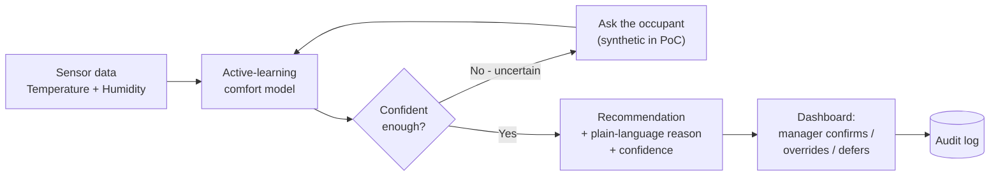
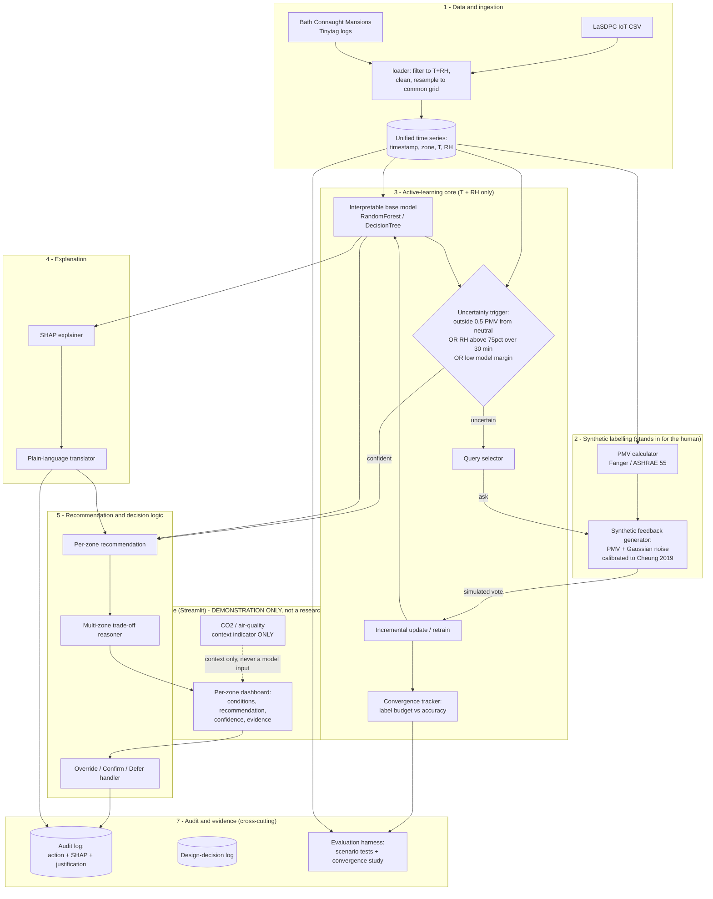
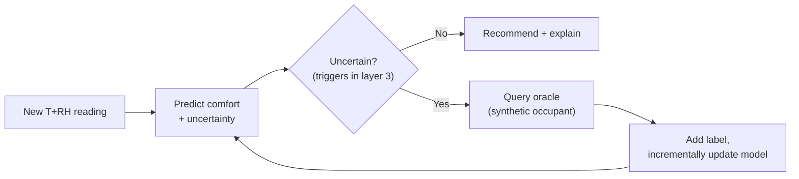

# System Architecture (O3)

Proof-of-concept active-learning system for thermal comfort in a heritage building. This document
is the Sprint 2 / Objective **O3** deliverable: it defines the components, the data flow, the
active-learning uncertainty trigger, and the query/decision logic.

> **Scope (per supervisor direction, 2026-07-28).** The formal research objective is to investigate
> **whether patterns in the sensor data can be learned through active learning, and whether the
> resulting query behaviour serves as a valid proxy for AI-mediated interaction with humans.** The
> experiment and its in-depth analysis are the primary contribution. The Streamlit interface
> (Layer 6) is a **demonstration artefact, not a research object**: it exists to make the loop
> inspectable, and any observations drawn from it must be reported as **exploratory and
> non-speculative**, grounded strictly in what the results show. No interface design claims are made.

> **Design principle.** The architecture is the algorithmic embodiment of the Burra Charter's
> *minimum-intervention* principle: the system stays silent unless it is uncertain, queries only
> then, and logs everything for audit. Active learning *is* minimum intervention expressed in code —
> and the proxy question is precisely whether that minimal querying is sufficient.

---

## 1. Simplified architecture (for non-technical readers)

**Read it as one sentence:** temperature and humidity go in; a model decides whether it is confident;
if not, it asks (in the proof of concept a synthetic occupant answers); when confident it produces a
plain-language recommendation that a manager confirms, overrides, or defers — and every step is logged.

---

## 2. Detailed architecture

### The active-learning loop, isolated

---

## 3. Why these choices (design-decision log seed)

| Decision | Chosen | Alternatives considered | Criterion |
|---|---|---|---|
| Base model | Interpretable RandomForest / DecisionTree | RL; deep NN; Gaussian Process | Interpretability + no large labelled set needed (D1 Table 2.1) |
| Sample efficiency | Active learning (query on uncertainty) | Exhaustive labelling; static RF | ~60% fewer queries (Tekler 2023); mirrors minimum intervention |
| Labels | Synthetic PMV + calibrated Gaussian noise | Real occupant votes; reuse ASHRAE DB II | Ethics/scope; avoids distribution mismatch (D1 §1.1.2) |
| Uncertainty trigger | Outside ±0.5 PMV **OR** RH >75% >30 min **OR** low margin | Pure model-entropy threshold | Combines comfort science with model confidence; auditable |
| Explanation | SHAP in audit log, plain language to user | Raw SHAP to user; no explanation | Calibrated trust for non-technical user (Amershi 2019 G11) |
| CO₂ / air quality | Interface context indicator only | Add as model feature | Hard scope constraint — T+RH only model |

---

## 4. Map to the codebase

Each architecture layer becomes a package under `dissertation_code/` (built incrementally per sprint):

| Layer | Package | Status | Research role |
|---|---|---|---|
| 1 Data & ingestion | `dissertation_code/data/` (extends current `eda/loader.py`) | EDA done; unified loader next | **In scope** — enables the experiment |
| 1b EDA | `dissertation_code/eda/` | **Done (Sprint 1)** | **In scope** — O2 characterisation |
| 2 Synthetic labelling | `dissertation_code/comfort/` (`pmv.py`, `synthetic_labels.py`) | Sprint 1 close / Sprint 2 | **In scope** — the synthetic oracle |
| 3 Active-learning core | `dissertation_code/model/` (`base.py`, `active_learning.py`) | Sprint 3 | **PRIMARY** — the experiment itself |
| 4 Explanation | `dissertation_code/explain/` (`shap_explain.py`, `narrate.py`) | Sprint 3 | **In scope** — analysing *why* the loop queries what it queries |
| 5 Recommendation & decision | `dissertation_code/recommend/` (`recommender.py`, `tradeoff.py`, `decision.py`) | Sprint 3 | Supporting — demonstration + audit plumbing |
| 6 Interface | `dissertation_code/dashboard/app.py` (Streamlit) | Sprint 3 | **Demonstration only** — exploratory observations, no interface claims |
| 7 Audit & evaluation | `dissertation_code/audit/` + `dissertation_code/evaluation/` | Sprint 3–4 | **PRIMARY** — the in-depth results analysis |

---

## 5. Cross-cutting invariants (must hold everywhere)

- **Model inputs are temperature + RH only.** CO₂/light enter the dashboard as context, never the model.
- **The active-learning experiment is the research contribution.** Layers 3 and 7 carry the formal
  objective; every other layer exists to enable or interrogate them.
- **Every query and recommendation is auditable.** SHAP values land in the audit log; the audit trail
  is the evidence base for the in-depth analysis.
- **Interface findings are exploratory, never speculative.** Anything observed through the dashboard
  is reported as an exploratory observation grounded in results — never as a primary finding, and
  never as a claim about how real humans would behave.
- **Synthetic labels validate mechanics and the proxy question, not real-occupant accuracy.** State
  this honestly anywhere results are reported.
