# Architecture Justification

**Project:** Human–AI Decision Support for Digital Twins of Heritage Buildings
**Author:** Srinidhi | MSc AI, University of Bath

This document explains *why* each architectural decision was made, grounded in the research
question, the heritage context, and the constraints of the proof-of-concept scope.

**Research question (formal scope, per supervisor direction 2026-07-28):**
*Can patterns within temperature and humidity sensor data be learned through active learning, and
can the resulting query behaviour serve as a valid **proxy** for AI-mediated interaction with
humans — without requiring live human feedback?*

The operative word is **proxy**. This is not merely "does active learning work on this dataset" as
an isolated ML exercise. It asks whether the loop's *query strategy* — which readings it chooses to
ask about, and when it stops asking — meaningfully approximates what would otherwise require live
back-and-forth with a real occupant.

---

### Scope boundary (important)

| In formal scope | Out of formal scope |
|---|---|
| Training the active-learning system on the comfort data | Building or evaluating human-facing interfaces |
| Evaluating whether learned patterns are a valid proxy for human feedback | Claims about how real humans would respond |
| In-depth analysis of the experiment results (convergence, query behaviour, SHAP) | Human-in-the-loop as a primary research objective |

The Streamlit dashboard exists as a **demonstration artefact** — it makes the loop inspectable and
provides an audit surface. It is **not** a research object. Any observation drawn from it is
reported as an **exploratory observation**, grounded strictly in what the results show, and never
speculative.

---

## 1. The central idea — architecture as research argument

Every layer of the system is a direct answer to a specific part of the research question. The
architecture is not a generic ML pipeline — it is the algorithmic embodiment of the Burra Charter's
**minimum-intervention** principle: stay silent unless uncertain, query only then, and log
everything. The proxy question is precisely whether that minimal querying is *sufficient*.

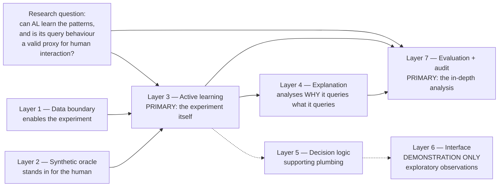

Solid arrows carry the formal research objective. Dashed arrows lead to the demonstration surface,
which supports the work but makes no research claim of its own.

---

## 2. Full system flow

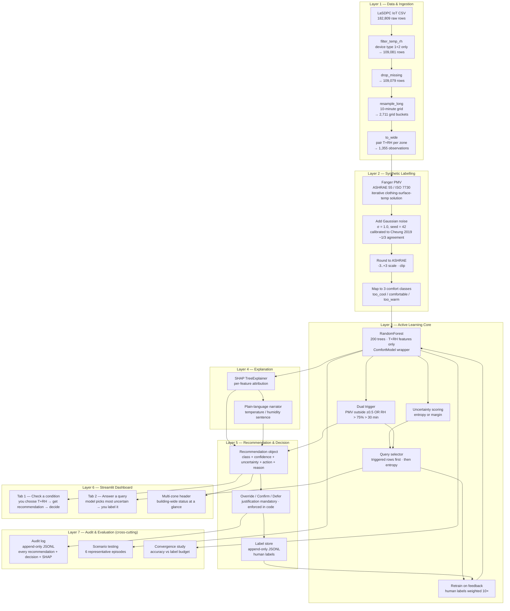

---

## 3. Why each layer exists — justified

### 3.1 Layer 1 — Data boundary (why T+RH only, enforced in code)

The modelling scope is temperature + relative humidity. CO₂ and light sensors are in the raw
dataset but are **rejected at the schema level** before reaching any other layer. This is not just
a config flag — `validate_long()` raises a hard `SchemaError` on any non-T+RH channel.

**Why enforce at data ingestion, not at the model?**
Putting the constraint at the earliest layer means it cannot be accidentally bypassed by a future
code path. It is an ethical commitment made in code.

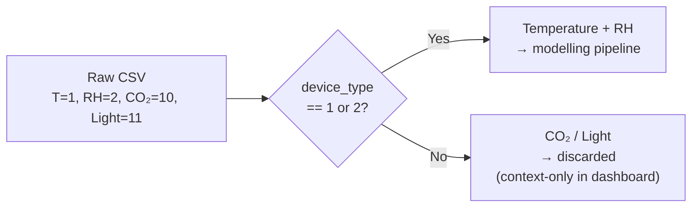

**Why the 10-minute resample?**
T and RH come from *separate physical devices* that log every 5–24 seconds, independently. An
exact-timestamp pivot paired only **5 of 109,081 rows** — essentially no usable data. Resampling
each `(zone, channel)` pair onto a 10-minute grid by mean recovered **1,355 paired observations**
across all 4 zones. This was discovered by running the pipeline, not assumed — it is Design
Decision DD-006.

---

### 3.2 Layer 2 — Synthetic labels (why PMV + noise, not real occupant votes)

No real occupant survey data exists for these buildings. Three options were considered:

| Option | Problem |
|---|---|
| Collect real votes | Requires ethics approval; out of 16-week project scope |
| Reuse another labelled dataset | Statistical mismatch — different population, climate, building type |
| Synthetic labels (PMV + noise) | Chosen: scientifically grounded prior + calibrated noise |

**Why PMV as the base?**
Fanger's PMV (ASHRAE 55 / ISO 7730) is the globally accepted thermal comfort standard. It
provides a grounded prior — not a random starting point. But PMV is only correct at the
individual level in ~33% of cases (Cheung et al. 2019). Using raw PMV as the label would
be circular: predicting PMV from PMV.

**Why add Gaussian noise (σ = 1.0)?**
The noise reproduces the real individual-level disagreement rate. σ = 1.0 was calibrated so
that `pmv_agreement_rate()` returns ~0.33 on a balanced temperature/humidity grid, matching
Cheung et al.'s benchmark. On the real LaSDPC data it came out at **0.365** — confirming the
noise structure is realistic, not arbitrary. This is Design Decision DD-004.

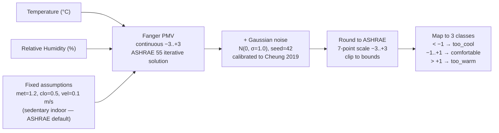

**Honest limitation:** This validates that the system *mechanics* work end-to-end. It does **not**
prove accuracy for a real occupant of this specific building. That is explicitly future work,
requiring ethics approval and occupant recruitment.

---

### 3.3 Layer 3 — Active learning (why not a static model)

The research question asks how the system learns *when* to query. A static model trained once
never improves from human feedback and cannot personalise to a specific building or occupant.
Active learning solves this.

**Why active learning specifically?**
The Burra Charter's minimum-intervention principle says: do not act unless necessary. Active
learning is the computational equivalent — it queries only when the model is genuinely uncertain,
and stays silent otherwise. Tekler (2023) showed AL needs ~60% fewer labels than passive labelling
to reach equivalent accuracy.

**Why Random Forest, not a neural network or Gaussian Process?**

| Requirement | RF | Neural Net | GP |
|---|---|---|---|
| Works with ~1,355 rows | ✅ | ❌ needs large labelled set | ✅ |
| Interpretable with SHAP | ✅ TreeExplainer | ❌ no tree structure | ❌ |
| Handles 2 features cleanly | ✅ | ✅ overkill | ✅ |
| Deterministic/auditable | ✅ fixed seed | harder to audit | ✅ |

RF is the only option that satisfies all four constraints simultaneously.

**Why the dual uncertainty trigger?**
Pure model entropy alone would miss domain-relevant moments:

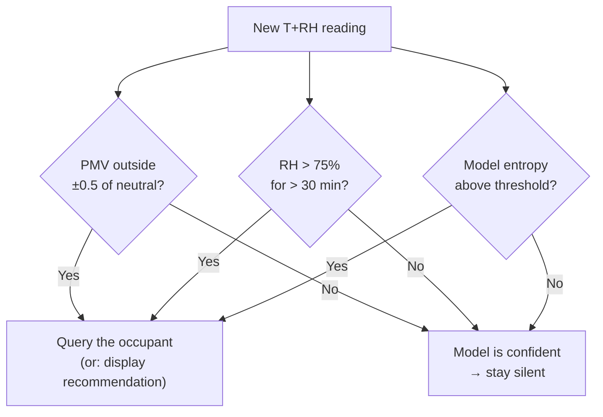

A building could have RH > 75% — a known heritage moisture risk — while the model is still
confident (because it has seen similar conditions). The domain trigger catches this case that
pure entropy would miss. This is Design Decision DD-005 and DD-010.

**Why "retrain on update" rather than `partial_fit`?**
Random Forest has no `partial_fit`. Using an incremental linear model (`SGDClassifier`) would
destroy the tree structure that SHAP requires for its TreeExplainer. At PoC scale (~1,400 rows)
a full retrain is sub-second. Human labels are weighted **10×** so even a handful of feedback
labels visibly shift predictions — the closed loop is demonstrable. DD-013, DD-014.

---

### 3.4 Layer 4 — Explanation (why SHAP, why plain language)

Every recommendation must be legible to a non-technical facilities manager. SHAP provides a
theoretically grounded attribution — exactly how much each feature (temperature vs humidity)
pushed the prediction toward the predicted class.

**Why SHAP values go to the audit log, not the dashboard?**
Raw SHAP numbers (e.g. temperature +0.38, humidity +0.12) are accurate but opaque to a manager.
Showing them as the primary output would undermine calibrated trust (Amershi 2019, G11).
The narration layer converts the SHAP attribution into a plain-language sentence, e.g.:
*"Temperature is the main driver — at 29 °C it is pushing comfort toward too warm."*

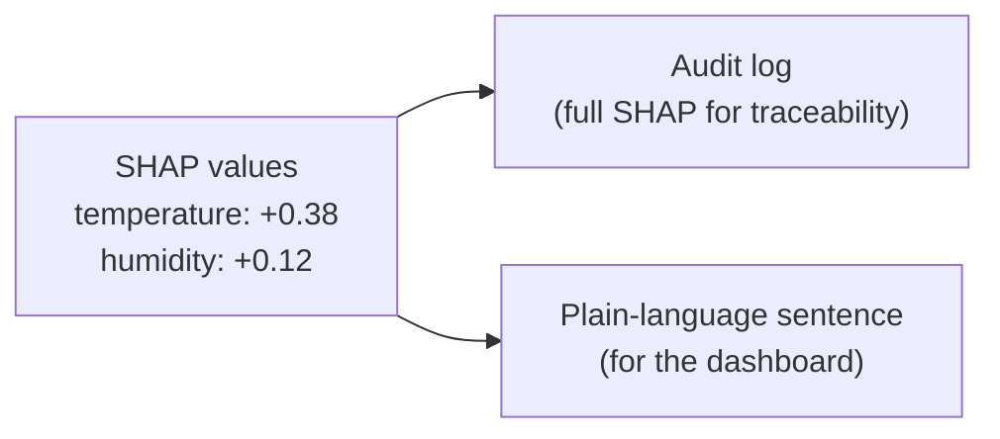

---

### 3.5 Layer 5 — Decision logic (why three options, why justification mandatory)

**Why confirm / override / defer (not just accept/reject)?**
- **Confirm** — manager agrees; predicted class becomes a stored training label.
- **Override** — manager disagrees; their chosen class becomes the label, personalising the model.
- **Defer** — manager is unsure; nothing is labelled; the system logs the deferral and moves on.

Defer is critical for heritage contexts — forcing a binary choice when the manager is unsure
would produce low-quality labels and undermine the model over time.

**Why is justification mandatory (enforced in code)?**
`record_decision` raises an exception if the justification string is empty. This cannot be
bypassed by any UI or API caller. The heritage requirement is that every intervention must be
explainable *why*, not just *what* — the audit trail is the evidence that the building's
management was exercised responsibly. DD-011.

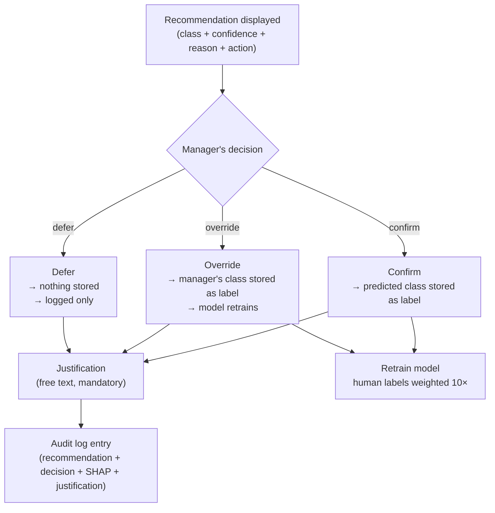

---

### 3.6 Layer 6 — Interface (demonstration artefact, not a research object)

> **Scope note.** Per supervisor direction, interface design is outside the formal dissertation
> scope. This layer exists to make the active-learning loop *inspectable* — so the experiment's
> query behaviour can be observed and audited directly. It is not evaluated as an interface, and
> no claims are made about its usability or about how real humans would respond to it. Findings
> surfaced through it are reported as **exploratory observations**, never as primary results.

Streamlit was chosen for PoC scope — it keeps the interface as a pure display/input surface
with **no business logic**. All model calls, label writes, and audit writes happen in the layer
modules, making the dashboard replaceable without touching any other component. That separation
is what allows the interface to be descoped from the research claims without touching the
experiment: Layers 1–4 and 7 run headlessly via `evaluation/run.py`, entirely independent of
the dashboard.

The two-tab structure demonstrates the two directions of the loop:

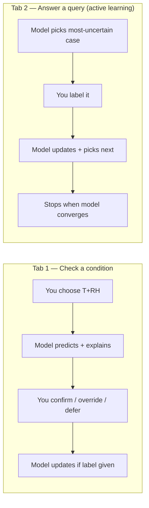

CO₂ appears in the header as a context indicator only — visible to the manager as occupancy
information, but drawn as a dashed line because it never enters the model.

---

### 3.7 Layer 7 — Audit log (why cross-cutting, why append-only)

The audit log is not a final step — it is a constraint that every other layer must satisfy.
It is append-only (no delete, no update) because the record of building management decisions
is itself part of the building's history in a heritage context. Deleting an entry would be
equivalent to erasing a maintenance record.

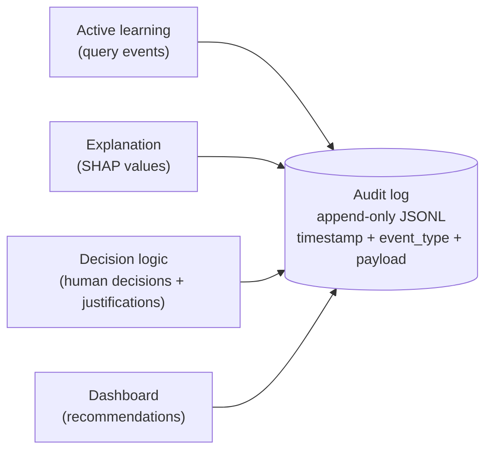

**Why JSONL (one JSON object per line)?**
Each line is independently parseable. The file can be streamed, grepped, or loaded in chunks
without reading the whole log. It is human-readable, language-agnostic, and corruption in one
line does not break the rest.

---

## 4. The full closed learning loop

This is the core of the proof of concept — the feedback path that closes the system into a
genuine learning loop, not just a predictor.

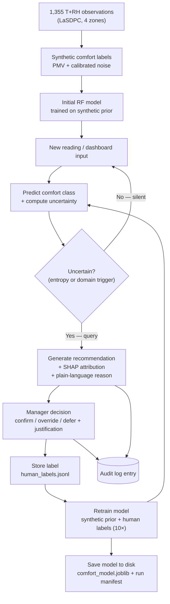

**End-to-end verification:** 24 °C / 55 % predicts *comfortable* with the synthetic prior →
after 5 human labels of *too warm* (weighted 10×) → predicts *too warm* → persists after
reloading the model from disk. The loop demonstrably closes.

> **Scope framing.** This verification demonstrates that the *mechanism* works — feedback
> propagates into the model and persists. It is reported as evidence that the loop is correctly
> implemented, **not** as a finding about human behaviour or interface effectiveness.

---

## 5. The proxy question — the formal research objective

This is the heart of the dissertation, and the part the architecture is ultimately built to answer.

### 5.1 What "proxy" means here

A conventional human-in-the-loop system requires a real person available to answer queries
continuously. That is expensive, intrusive, and — in a heritage building with residents — often
impractical. The research question asks whether the active-learning loop can stand in for that
interaction: whether **the patterns it learns and the queries it chooses** approximate what live
human feedback would have produced.

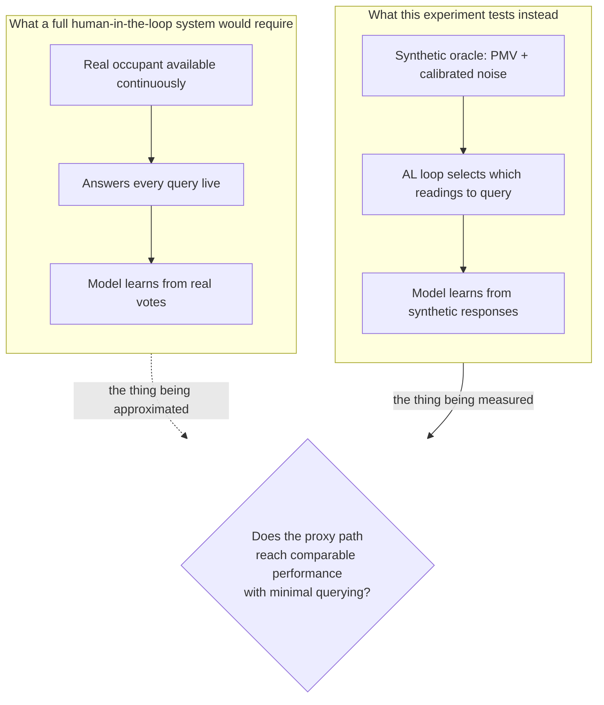

### 5.2 How the architecture answers it — three pieces of evidence

**Evidence 1 — Can the patterns be learned at all? (convergence study)**

If active learning could not reach the accuracy of a fully-labelled model, the proxy claim would
fail immediately. The convergence study measures exactly this:

| Measure | Result |
|---|---|
| Full-labelled baseline accuracy | 0.708 |
| Accuracy reached by the AL loop | within 5% of baseline |
| Labels required to get there | ~2% of the pool (~27 of 1,355) |

The accuracy ceiling (~0.71) is itself consistent with the 0.365 PMV-agreement rate — the model
cannot exceed the quality of its labels, which is the expected and correct behaviour.

**Evidence 2 — Are the queries it chooses sensible? (query behaviour analysis)**

A proxy is only valid if the loop asks about the *right* things. This is where the domain triggers
and SHAP layer earn their place in the architecture — they let the analysis show *why* each query
was selected, not just that it was:

- Do the queried readings cluster near genuine comfort boundaries, or are they arbitrary?
- Do the domain triggers (PMV ±0.5, RH > 75%) surface conservation-relevant conditions that pure
  entropy would have skipped?
- Does SHAP show temperature and humidity contributing in physically plausible directions?

This analysis is a primary deliverable — Ricardo's "very in-depth analysis of the results" is
substantially *this*.

**Evidence 3 — Does it stop asking? (minimum intervention)**

A proxy that queries constantly has not replaced anything. The convergence threshold
(`UNCERTAINTY_STOP_THRESHOLD = 0.35`) is what makes the minimum-intervention claim testable: the
system must demonstrably go quiet once it has learned enough.

### 5.3 What this design can and cannot establish

| Can establish | Cannot establish |
|---|---|
| Whether the patterns in T+RH data are learnable via AL | Whether a real occupant would agree with the model |
| How label-efficient the loop is (labels vs accuracy) | Whether the interface is usable or trusted |
| Whether query selection targets meaningful boundaries | How humans would behave when queried |
| Whether the loop converges and stops | Real-world comfort outcomes in the building |

The right-hand column is future work requiring ethics approval and occupant recruitment. Stating
this boundary explicitly is what keeps the exploratory observations non-speculative.

---

## 6. Design decisions summary

| Decision | Chosen | Alternatives ruled out | Reason |
|---|---|---|---|
| **DD-001** Package structure | Layered `dissertation_code/` packages | Flat module layout | One responsibility per module; mirrors architecture layers |
| **DD-002** Schema validation | Fail-loud `SchemaError` | Silent coerce/clip | Data-quality problems must surface; T+RH constraint enforced in code |
| **DD-003** PMV implementation | Hand-rolled Fanger PMV | `pythermalcomfort` library | Academic integrity — own understanding of the core method; verified against ISO 7730 |
| **DD-004** Noise calibration | σ = 1.0 Gaussian | Smaller/larger σ | Reproduces Cheung 2019's ~33% individual PMV accuracy on real data (0.365) |
| **DD-005** Uncertainty trigger | PMV outside ±0.5 OR RH > 75% > 30 min | Pure entropy threshold | Combines comfort science with model confidence; auditable; heritage-relevant moments never skipped |
| **DD-006** Data alignment | Resample to 10-min grid | Exact-timestamp pivot | Exact pivot paired only 5 rows; resample recovered 1,355 paired observations |
| **DD-007** Comfort label threshold | &#124;vote&#124; ≤ 1 = comfortable | vote == 0 strictly | Strict neutral produces almost no positives; ≤ 1 matches occupant self-reporting norms |
| **DD-008** AL with fallback | Pool-based AL + documented static RF fallback | AL only | Risk register: if AL fails to converge, one-line swap to static RF |
| **DD-009** 3-class target | too_cool / comfortable / too_warm | Binary; 7-point scale | Direction (warm vs cool) makes the recommendation actionable; 7 classes too sparse under noisy labels |
| **DD-010** Query priority | Triggered rows first, then entropy | Pure entropy | Heritage-critical moments (high RH) must never be deprioritised by model entropy alone |
| **DD-011** Mandatory justification | `record_decision` raises if empty | Optional free text | Heritage auditability — every intervention must say *why*, enforced in code |
| **DD-012** SHAP routing | Raw SHAP to audit log; plain language to user | Raw SHAP as primary output | Calibrated trust (Amershi 2019 G11); managers read sentences, not numbers |
| **DD-013** Retrain on update | Full retrain each feedback cycle | `partial_fit` / incremental | RF has no `partial_fit`; switching to a linear model would lose SHAP TreeExplainer |
| **DD-014** Human label weight | 10× vs synthetic labels | Equal weight | Equal weight → feedback invisible among 1,355 synthetic rows; 10× produces demonstrable personalisation |
| **DD-015** Model persistence | joblib + JSONL label store | Memory-only | Learning must survive restarts; run manifest records seed, config, label counts for reproducibility |
| **DD-016** Active query mode | `next_query` surfaces single most-uncertain instance | Passive user input only | "Active" learning means the *system* chooses what to ask (Settles 2009); stop threshold = minimum intervention |

---

## 7. Definition and explanation of terms

Only terms that are genuinely non-obvious are explained here — comfort science units, research
methodology phrases, and ML concepts that have project-specific meaning. If you hit a word not
listed, it is standard Python or general software engineering.

---

### Comfort science

**ASHRAE**
The *American Society of Heating, Refrigerating and Air-Conditioning Engineers* — the
international body that publishes building comfort standards. "ASHRAE 55" is their specific
standard that defines what thermally comfortable means and how to calculate it.

**ISO 7730**
The *International Organisation for Standardisation* standard that covers thermal comfort in
moderate indoor environments, using the same Fanger PMV equation as ASHRAE 55. Engineers
treat the two as equivalent and interchangeable.

**PMV — Predicted Mean Vote**
The core thermal comfort equation, developed by Danish professor Ole Fanger (1970s), adopted
by ASHRAE 55 and ISO 7730. It outputs a number on a scale from −3 (very cold) to +3 (very
hot), where 0 is neutral. It predicts what a *large group* of people would vote on average —
not any one individual.

The equation needs six inputs. We only measure two (T and RH); the other four are fixed to
standard indoor assumptions:

| Input | Source in this project |
|---|---|
| Air temperature (°C) | Measured by sensor |
| Relative humidity (%) | Measured by sensor |
| Metabolic rate — how active the person is | Fixed: 1.2 met (seated, light work) |
| Clothing insulation | Fixed: 0.5 clo (light indoor clothing) |
| Air velocity | Fixed: 0.1 m/s (still room air) |
| Mean radiant temperature | Assumed equal to air temperature (no radiometer) |

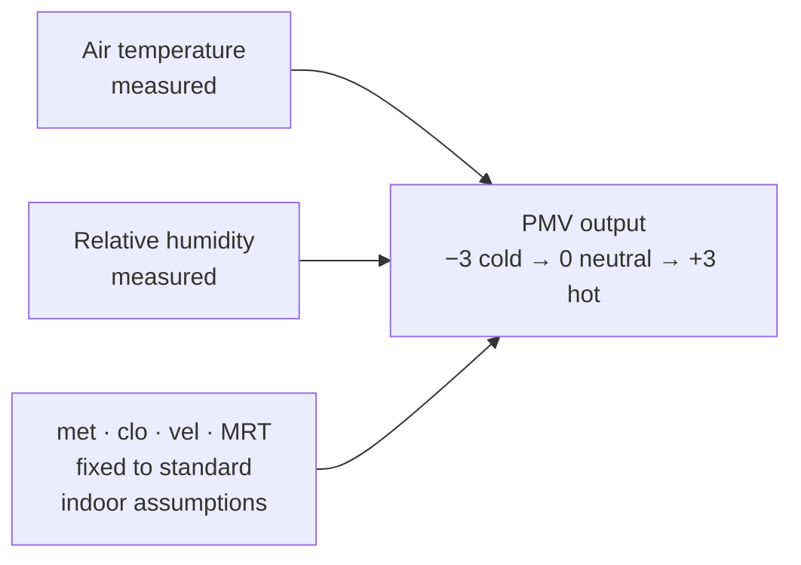

**Why PMV is not enough on its own:**
PMV is only correct for an *individual* person about 33% of the time (Cheung et al. 2019).
It is a useful population-level prior, but it needs personalisation — which is exactly what
the active learning loop provides.

**ASHRAE 7-point sensation scale**
The standard labels a person uses to describe how they feel thermally:

| −3 | −2 | −1 | 0 | +1 | +2 | +3 |
|---|---|---|---|---|---|---|
| Cold | Cool | Slightly cool | Neutral | Slightly warm | Warm | Hot |

**Comfort class (too\_cool / comfortable / too\_warm)**
A simplified 3-way grouping used as the model's prediction target. Three classes instead of
seven because it maps directly to a building action (heat / do nothing / cool), and seven
sparse classes are hard to learn from noisy synthetic labels.

| Sensation vote | Comfort class |
|---|---|
| ≤ −2 | too\_cool |
| −1, 0, +1 | comfortable |
| ≥ +2 | too\_warm |

**met (metabolic rate)**
How much heat a person's body generates, relative to their body surface area. 1 met = 58.15
W/m². Sitting quietly is ~1.0–1.2 met; running is ~7 met.

**clo (clothing insulation)**
How much a person's clothing insulates them. 0.5 clo = light shirt and trousers.
1.0 clo = a business suit.

**Mean radiant temperature (MRT)**
The average temperature of all surfaces surrounding a person (walls, floor, ceiling). A cold
stone wall can make someone feel chilly even if the air is warm. Since there are no radiometers
in this project, MRT is approximated as equal to air temperature.

**The Burra Charter**
An international heritage conservation document (ICOMOS 1979) whose core principle is
**minimum intervention** — do only what is necessary, carefully, and document everything.
This project uses active learning as the computational version of that principle: stay silent
unless uncertain, ask only then, act only with human confirmation.

---

### Machine learning

**Label**
The known correct answer attached to a training example — e.g. "(24°C, 55% RH) → comfortable".
The model learns by comparing its predictions against labels. In this project, labels are
*synthetic* (computed from PMV + noise) because no real occupant survey data exists.

**Synthetic labels**
Labels generated by a mathematical model rather than collected from real people. They let the
system be trained and tested end-to-end, but they cannot prove accuracy for any real occupant —
a limitation stated explicitly throughout the project.

**Confidence**
In a Random Forest, the fraction of trees that voted for the predicted class. 75% confidence
= 150 out of 200 trees agreed. Low confidence means the trees are split.

**Entropy (information entropy)**
A number that measures how uncertain or spread-out a probability distribution is. If the
model gives probabilities [0.9, 0.07, 0.03] across three classes, entropy is low (confident).
If it gives [0.35, 0.33, 0.32], entropy is high (genuinely unsure). The formula is
−Σ p × log(p). Higher entropy → more useful to ask a human.

**Margin sampling**
An alternative to entropy: the gap between the top-1 and top-2 class probabilities. A small
gap means the model is torn between two options. Both entropy and margin are available as
`UNCERTAINTY_STRATEGY` in `config.py`.

**Sample weight**
A number that tells the model how much to emphasise a particular training example. Human
labels in this project get weight 10 — ten times more influential than any single synthetic
label. Without this, a few human answers would be invisible among 1,355 synthetic ones.

**Retrain vs partial\_fit**
`partial_fit` would update a model incrementally with one new example without touching the
rest. Random Forest does not support it. So this project does a full retrain each time —
all 1,355 synthetic rows plus all human labels, from scratch. At this data size it takes
under a second, so there is no practical cost.

**Joblib**
A Python utility for saving and loading objects — used here to persist the trained
Random Forest to disk (`comfort_model.joblib`). Without it, the model would forget everything
on every restart.

**Run manifest**
A small JSON file saved alongside the model recording *how* it was trained: random seed,
number of synthetic labels, number of human labels, feature names, and the timestamp. Makes
every trained model fully reproducible and auditable.

---

### Active learning — how it actually works in this PoC

#### The core idea

A standard ML model is trained on a fixed, pre-labelled dataset — you collect all the labels
upfront, then train. Active learning flips this: the model starts with almost no labels, and
it *asks* for labels one batch at a time, choosing which examples to ask about. The key
insight is that not all examples are equally informative. If the model is already confident
about 1,000 of your 1,355 sensor readings, labelling those 1,000 would not teach it much.
It only needs labels on the ~50 readings it is genuinely unsure about.

In this project the model reaches within 5% of the accuracy it would achieve if you labelled
everything — using only ~2% of the total labels. That is what "label-efficient" means.

---

#### Step-by-step: what actually happens in this PoC

**Step 1 — Start with synthetic labels (the PMV prior)**

The 1,355 paired T+RH observations are passed through the PMV equation + Gaussian noise to
generate synthetic comfort labels. These are not real occupant votes — they are a mathematically
generated starting point. The model is trained on all 1,355 of these synthetic labels.

Think of this as: *"before anyone in the building has said anything, what does the textbook
equation predict?"*

**Step 2 — Scan the pool and score every reading for uncertainty**

The trained model runs `predict_proba` on every reading in the pool. This gives three
probabilities per reading — one for each class (too_cool, comfortable, too_warm).

For example, for Zone 4 at 23.7°C / 81% RH the model might return:
```
too_cool:    0.08
comfortable: 0.47   ← slight lean, but not confident
too_warm:    0.45
```
The entropy of [0.08, 0.47, 0.45] is high — the model is nearly 50/50 between two classes.
It does not know what to predict here.

Contrast that with Zone 3 at 17°C / 55% RH:
```
too_cool:    0.91
comfortable: 0.07
too_warm:    0.02
```
Entropy of [0.91, 0.07, 0.02] is very low — the model is confident. No point asking.

**Step 3 — Apply the domain triggers first**

Before purely following entropy, the query selector checks two domain rules from the comfort
science:
- Is PMV outside ±0.5 of neutral (the ASHRAE comfort band)?
- Is RH above 75% (a known heritage moisture threshold)?

If either fires, that reading jumps to the front of the queue *regardless* of entropy. This
matters because a building at 81% RH is a conservation concern — the system should ask about
it even if the model happens to be confident. The domain knowledge overrides pure statistics.

**Step 4 — Pick the single most uncertain reading and surface it**

The "Answer a query" tab in the dashboard shows the highest-priority uncertain reading:

> *Zone 4 — temperature 23.7°C, humidity 81% — model uncertainty 91%, current guess: comfortable*

The dashboard is asking: *"I'm not sure about this condition. How would a person feel here?"*

**Step 5 — The facilities manager answers**

The manager selects: `too warm`

That answer is stored in `human_labels.jsonl` with source tag `"human_query"`.

**Step 6 — Retrain with the new label, weighted**

The model retrains on:
- All 1,355 synthetic labels (weight = 1.0 each)
- The 1 new human label for Zone 4 / 23.7°C / 81% (weight = 10.0)

The human label counts as much as 10 synthetic rows. The model updates its understanding
of that boundary region.

**Step 7 — Repeat: pick the next most uncertain reading**

The loop goes back to Step 2. The Zone 4 / 23.7°C / 81% reading is now labelled so it
leaves the pool. The next-highest-entropy unlabelled reading is surfaced.

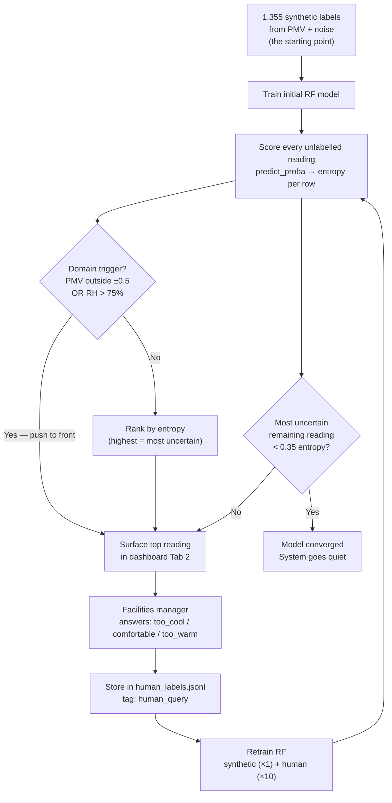

---

#### A concrete worked example from the PoC

Here is the closed-loop demonstration that was verified end-to-end:

| Step | Action | Result |
|---|---|---|
| 1 | Model trained on synthetic labels only | Predicts 24°C / 55% → **comfortable** (68% confidence) |
| 2 | Manager sets 24°C / 55% in Tab 1, sees "comfortable" | Model is confident — no trigger fired |
| 3 | Manager overrides: "Actually this feels too warm" + justification: *"south-facing room runs hot"* | Label stored: (24°C, 55%, too_warm, weight=10) |
| 4 | Model retrains | 1 human label + 1,355 synthetic |
| 5 | Manager checks 24°C / 55% again | Model now predicts **too_warm** |
| 6 | Manager restarts the dashboard | Model reloads from disk — still predicts **too_warm** |

Five such overrides in sequence reliably flip the prediction and keep it flipped across
restarts. The loop is demonstrably closed: human feedback → stored label → retrained model →
changed prediction → persisted.

---

#### The two ways to interact with the loop (the two dashboard tabs)

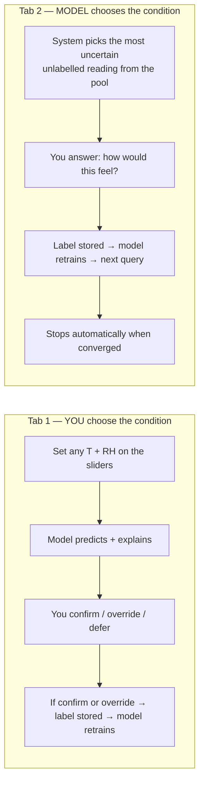

Tab 1 is **you asking the model** — useful for spot-checking specific conditions.
Tab 2 is **the model asking you** — the genuine active-learning loop.

Both write to the same label store and trigger the same retrain. The difference is only in
who chose the condition.

---

#### Why this embodies minimum intervention

A simple passive system would surface every uncertain reading all the time. This system does
three things to stay quiet:

1. **It only surfaces readings where it is genuinely uncertain** — confident predictions never
   become queries.
2. **It uses a convergence threshold** — once the most uncertain remaining reading drops below
   entropy 0.35, it stops asking entirely and signals convergence.
3. **Domain triggers are precise** — the ±0.5 PMV band and the 75% / 30-min RH rule are the
   exact boundaries defined in the ASHRAE comfort standard, not arbitrary numbers. The system
   triggers only on conditions that have a known conservation or comfort rationale.

The result: in the convergence study, the model reached near-ceiling accuracy after labels on
approximately **27 readings out of 1,355** — it asked about 2% of the pool and then went
silent.

---

#### Key terms

**Pool-based active learning** — the 1,355 sensor readings form a fixed pool; the model picks
from it. (The alternative, stream-based, would process each new reading live as it arrives.)

**Oracle** — the entity that answers the model's queries. In this PoC the oracle is
*synthetic* (the PMV + noise generator stands in for a real person). In a real deployment the
oracle is the facilities manager.

**Seed labels** — 20 synthetic labels used to train the very first model so it can compute
uncertainty at all. Without any labels the model cannot run.

**Convergence** — when the most uncertain remaining unlabelled example drops below entropy
threshold 0.35. The system stops querying and displays a convergence message.

**Label budget** — the total number of human answers the system collects before convergence.
In this project that is ~27 (2% of 1,355).

---

### Explainability

**SHAP (SHapley Additive exPlanations)**
A method (rooted in game theory) for explaining *why* a model made a specific prediction by
fairly attributing that prediction to each input feature. It answers: "how much did
temperature contribute vs humidity?" SHAP gives a signed number per feature —
positive = pushed toward the predicted class, negative = pushed against it.

**SHAP TreeExplainer**
The version of SHAP designed specifically for tree-based models (Random Forest, Decision
Tree). It is exact and fast because it exploits the tree structure directly.

**Feature attribution**
Assigning credit (or blame) for a prediction to each input feature. SHAP is the gold-standard
principled method for this. The raw numbers go to the audit log; the user sees a plain-language
sentence generated from them.

---

### Research methodology

**Digital twin**
A virtual, continuously-updated model of a physical place, fed by real sensor data. Here: the
data pipeline + model mirrors the real building's thermal state, letting managers reason about
comfort in all zones without walking around.

**Heritage building**
A building of historical or cultural significance — often listed or protected. Physical and
environmental interventions must be minimal, reversible, and documented. Connaught Mansions,
Bath is the target building.

**Design science research (Hevner et al. 2004)**
A research methodology where the main contribution is a designed *artefact* (a system or
tool) that solves a real-world problem, paired with a rigorous evaluation. The artefact here
is the active-learning system and its query strategy; the evaluation is the convergence and
query-behaviour analysis.

**Proof of concept (PoC)**
Demonstrates that the core idea and mechanics work end-to-end — not that the system is
production-ready or that it is accurate for real occupants. This project is explicitly a PoC.
A real-occupant validation study is future work requiring ethics approval.

**Gaussian noise / N(0, σ)**
Random numbers drawn from a normal (bell-curve) distribution centred on 0. Adding N(0, 1.0)
noise to PMV makes the synthetic vote scatter around the PMV value in a realistic way — most
of the time close to PMV, occasionally quite different, matching the pattern seen in real
occupant data.

**Standard deviation (σ)**
How widely spread the noise is. σ=1.0 means roughly two-thirds of random draws fall within
±1 of zero. Smaller σ = noise tightly clustered around PMV (too agreeable). Larger σ = noise
dominates signal (too random). σ=1.0 was chosen because it reproduces the ~33% individual
PMV agreement rate from Cheung et al. (2019).

**Calibration**
Tuning a parameter so that a model's outputs match a known real-world reference. Here: σ=1.0
is calibrated so synthetic label agreement with PMV is ~33% — matching Cheung et al.'s finding
— making the synthetic feedback a realistic stand-in for a real population.

**Cheung et al. (2019)**
The paper that provides the empirical anchor for the noise calibration:
Cheung, T. et al. *Analysis of the accuracy of PMV in predicting thermal sensation for four
climate regions.* Building and Environment, 153, 205–217.
Key finding: PMV correctly classifies individual thermal sensation in fewer than 34% of cases.

**Scenario testing**
Evaluation by defining specific input conditions with known expected outputs, then checking
the system produces those outputs. Six representative T+RH conditions were used; the model
matched all six (100% match rate).

**Convergence study**
Plots accuracy vs number of labels collected to show how quickly active learning approaches
the full-label accuracy ceiling. Result: within 5% of the ceiling using ~2% of labels.

**Baseline accuracy**
Accuracy when the model is trained on *all* available labels — the theoretical ceiling. The
convergence study uses this as a reference to measure how quickly active learning gets there.

---

### Abbreviations

| Abbreviation | Meaning |
|---|---|
| ASHRAE | American Society of Heating, Refrigerating and Air-Conditioning Engineers |
| ISO | International Organisation for Standardisation |
| PMV | Predicted Mean Vote |
| MRT | Mean Radiant Temperature |
| met | Metabolic rate unit (1 met = 58.15 W/m²) |
| clo | Clothing insulation unit |
| RH | Relative Humidity |
| RF | Random Forest |
| AL | Active Learning |
| SHAP | SHapley Additive exPlanations |
| PoC | Proof of Concept |
| σ (sigma) | Standard deviation |
| JSONL | JSON Lines — one JSON object per line in a file |
| DD | Design Decision (DD-001 through DD-016 in `docs/design_decisions.md`) |
| LaSDPC | The IoT smart-building dataset used for training and evaluation |

---

## 8. One-sentence summary

The architecture is a direct translation of the research constraints into code: **only T+RH enters
the model** (scope + ethics), **uncertainty triggers before querying** (minimum intervention),
**SHAP explains why each query was chosen** (the analysis layer), **every event is audited**
(the evidence base), and **the active-learning experiment — not the interface — carries the
research claim**, with the proxy question answered by convergence, query behaviour, and stopping
behaviour rather than by any assertion about real human response.
